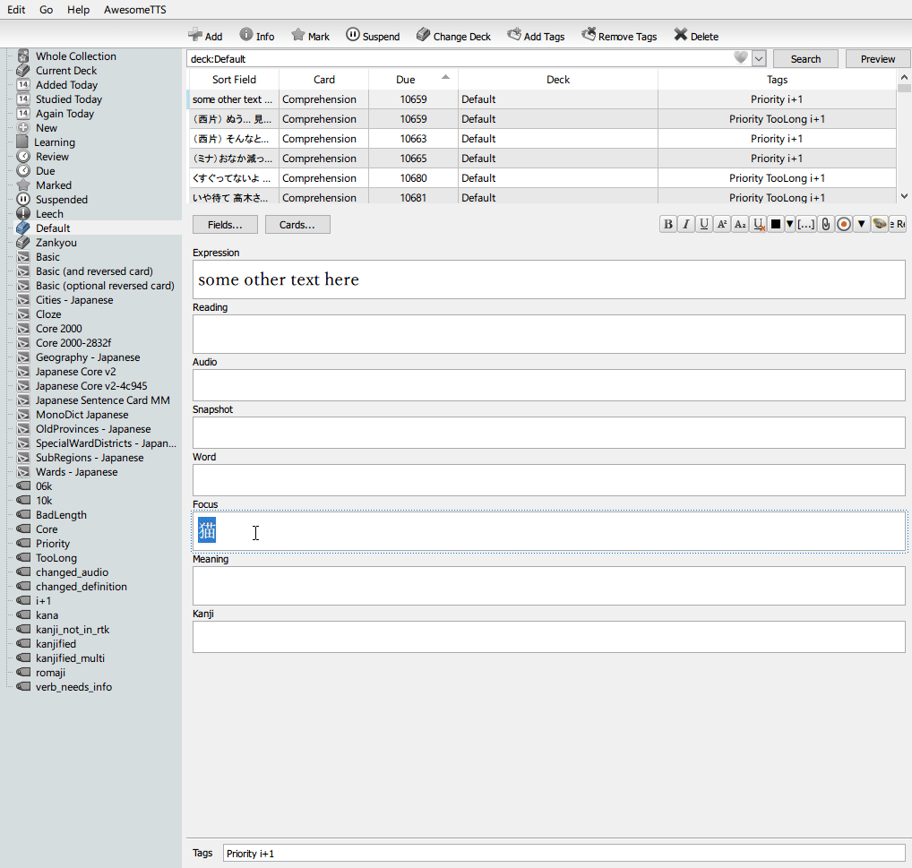

# -Anki-Shinmeikai-Addon
An anki addon that can add definitions from the shinmeikai dictionary for japanese words. The addon also has features to add RTK kanji keywords in a separate field as well as furigana for the definitions.  
In the repository there are two folder, one for each supported anki version. Simply drag and drop whatever's in the folder corresponding to your anki version into the addons folder (Usually C:\Users\USERNAME\AppData\Roaming\Anki2\addons) and restart anki.  The folders includes the two lists (RTK keywords and frequency) as well as the shinmeikai dicitonary.  

